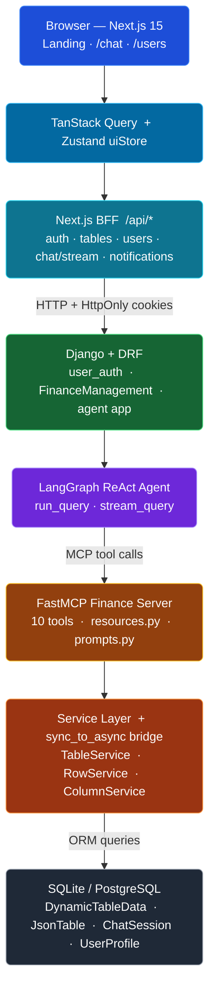

<div align="center">

# AI Data Brain

**A full-stack AI-powered data platform. Create any table you can imagine, then manage it entirely through natural conversation — in Bengali or English. No SQL. No forms. Just talk.**

[](https://python.org)
[](https://djangoproject.com)
[](https://nextjs.org)
[](https://react.dev)
[](https://typescriptlang.org)
[](https://anthropic.com)
[](https://github.com/jlowin/fastmcp)
[](https://langchain-ai.github.io/langgraph/)
[](LICENSE)

</div>

---

## Table of Contents

- [What This Is](#what-this-is)
- [How It Works End-to-End](#how-it-works-end-to-end)
- [Key Engineering Decisions](#key-engineering-decisions)
- [System Architecture](#system-architecture)
- [Features](#features)
- [Tech Stack](#tech-stack)
- [Quick Start](#quick-start)
- [Project Structure](#project-structure)
- [API Reference](#api-reference)
- [Environment Variables](#environment-variables)
- [Additional Documentation](#additional-documentation)
- [Troubleshooting / FAQ](#troubleshooting--faq)
- [Contributing](#contributing)
- [Author](#author)
- [License](#license)

---

## What This Is

AI Data Brain gives every user a personal, AI-managed spreadsheet system. You say *"create a table for my monthly expenses with columns Date, Category, and Amount"* — and Claude creates it. You say *"add a row: March rent, 25000 taka"* — Claude parses and inserts it. You say *"what did I spend most on last month?"* — Claude reads your data and answers.

The schema is fully dynamic. There is no `ALTER TABLE`. There are no migration files for user tables. The entire data layer reshapes itself at runtime based on what you ask for.

**What you can do:**

- Create tables with any columns you want — no predefined schema
- Add, update, and delete rows and columns via natural language chat
- Share tables with friends and control access per-user
- Query and summarize your data in Bengali or English
- Stream AI responses token-by-token for real-time feedback
- Access everything through a polished Next.js UI with virtualized table rendering
- Use voice input for truly hands-free operation

The project has two parallel paths to the same data: a **REST API** the frontend calls directly, and an **MCP server** that Claude calls when processing your query. Both talk to the same database.

---

## How It Works End-to-End

> A step-by-step walkthrough from typing a message to seeing the result in the table.

**1. User types in the chat box**
The Next.js frontend sends `POST /api/chat/stream` to the Next.js BFF (Backend For Frontend). The BFF forwards the request to Django at `POST /agent/streaming/` with the user's HttpOnly session cookie attached server-side — browser JavaScript never touches the cookie directly.

**2. Django authenticates and routes**
`AgentStreamingAPIView` validates the JWT cookie via the custom `JWTAuthentication` backend, extracts `user_id`, and calls `stream_query(query, user_id)`.

**3. LLM Provider selection**
`LLMProvider` creates a LangChain-compatible client — Claude Sonnet 4.6, Gemini, or DeepSeek — depending on the configured provider. All three implement the same interface so the rest of the system doesn't care which model runs.

**4. ReAct Agent loop begins**
`get_agent()` builds a LangGraph `create_react_agent` — a loop that lets the LLM reason, pick a tool, observe the result, and repeat until it decides it's done. Ten finance tools are available (`create_table`, `add_table_row`, `update_row`, `delete_column`, etc.) plus a live schema resource.

**5. Schema context injection**
Before the first LLM call, the agent fetches `schema://tables/{user_id}` — a live snapshot of the user's current tables and column names. Claude always knows what exists before it tries to write.

**6. Tool execution via FastMCP**
When Claude picks a tool, FastMCP deserializes arguments using `Annotated[type, Field(...)]`, validates via Pydantic, and calls the async Django service. The `user_id` is injected from a `ContextVar` — Claude cannot override it.

**7. Async/sync bridge**
The Django ORM is synchronous. The MCP server runs fully async. `sync_to_async` from `asgiref` runs each ORM call in a thread pool so the async event loop never blocks.

**8. Response streams back**
The tool returns a JSON result. Claude reads it, continues reasoning if needed, then writes a human-readable summary. The Django view yields it as an SSE event. The Next.js BFF translates it into the Vercel AI SDK data-stream format (`0:"text"\n`). The frontend's `useChat` hook appends tokens live as they arrive.

**9. Table updates instantly**
The `onFinish` callback in `ChatContainer` calls `queryClient.invalidateQueries(['tables', tableId, 'content'])`. TanStack Query refetches the table data. The virtual table re-renders only the visible rows — even for 10,000-row tables.

---

## Key Engineering Decisions

| Decision | Problem It Solves | Trade-off Accepted |
|----------|-------------------|--------------------|
| **3-tier JSON schema** (`DynamicTableData` → `JsonTable` → `JsonTableRow`) | Traditional relational tables require upfront schema; users want arbitrary columns at runtime | No relational integrity guarantees between columns; row data is not DB-level type-validated |
| **MCP over direct function calls** | Without MCP, Claude would generate raw SQL or call a generic API; it couldn't reliably multi-step | Separate MCP process adds a network hop and startup overhead |
| **`Annotated[type, Field(...)]` for tool parameters** | `Field(...)` as a default causes Pydantic to receive `FieldInfo` as the int's default → all ints arrive as `0` | Slightly more verbose parameter declarations |
| **`Field(exclude=True)` on `user_id`** | If `user_id` is in Claude's tool schema, prompt injection can target another user's tables | `user_id` must be injected via `ContextVar` — cannot be passed by the model |
| **`sync_to_async` bridge** | Django async ORM is incomplete (`bulk_update`, transactions); sync path preserves atomicity | Sync code runs in a thread pool, not the main async loop |
| **HttpOnly JWT cookies, not `Authorization` headers** | Browser JS cannot read HttpOnly cookies — XSS token theft is impossible | Custom `JWTAuthentication` backend required; CSRF must be handled explicitly |
| **Next.js BFF (Route Handlers)** | Three separate Axios clients had duplicate CSRF/refresh logic; browser→Django direct calls are brittle across environments | All API calls go through `/api/*`; adds one network hop in the browser |
| **TanStack Query for server state** | Context + `useReducer` caused full-tree re-renders on every cell edit | Query cache must be kept in sync with mutations (invalidation strategy) |
| **`@tanstack/react-virtual` for table rows** | Rendering 500+ rows caused the DOM to choke — mobile crashed, desktop lagged | Fixed row height (40px) required; dynamic measurement adds jank |
| **Vercel AI SDK `useChat`** | Rolling a custom streaming hook requires SSE parsing, error recovery, abort handling | BFF must emit the exact Vercel data-stream protocol (`0:"text"\n`, `8:[annotations]\n`) |
| **LangGraph ReAct agent** | A single LLM call can't handle multi-step operations like "rename column X then add a row" | Each tool call is a round-trip to Claude; latency compounds with step count |

---

## System Architecture



**Two paths to the same data:**
- **REST path** — Browser → BFF → Django DRF views → `FinanceManagement/services.py` → ORM
- **MCP path** — Browser → BFF → Django Agent view → LangGraph → FastMCP tools → async services → `sync_to_async` → ORM

---

## Features

### Frontend

| # | Feature | Detail |
|---|---------|--------|
| 1 | **Real-time AI chat** | Vercel AI SDK `useChat` hook; responses stream token-by-token via the BFF adapter |
| 2 | **Tool call visualizer** | Collapsible badges showing which MCP tools Claude called and with what arguments |
| 3 | **Virtualized table** | TanStack Table v8 + `@tanstack/react-virtual`; renders only visible rows — 10,000 rows at 60 fps |
| 4 | **Inline cell editing** | Click any cell to edit; auto-saves on blur/Enter via optimistic mutation |
| 5 | **Column management** | Double-click header to rename; hover to delete column |
| 6 | **Sidebar table browser** | Live-updating list of all tables; create, delete, and share from the sidebar |
| 7 | **Table sharing** | Share any table with friends; inline friend-picker panel |
| 8 | **Voice input** | `react-speech-recognition` for hands-free chat entry |
| 9 | **Dark / light theme** | CSS class toggle via `ThemeProvider`; no flash on reload |
| 10 | **BFF security layer** | All API calls proxied through Next.js Route Handlers; cookies forwarded server-side |

### Backend

| # | Feature | Detail |
|---|---------|--------|
| 1 | **Dynamic table schema** | Create tables with any columns at runtime — stored as JSON, no migrations |
| 2 | **Multi-step ReAct agent** | LangGraph agent that reasons, calls tools, observes results, and loops |
| 3 | **10 MCP finance tools** | Create/delete table, add/update/delete row, add/rename/delete column, share, query |
| 4 | **Live schema resource** | `schema://tables/{user_id}` gives Claude a real-time view of the user's tables before acting |
| 5 | **Streaming responses** | `stream_query()` yields SSE events; `AgentStreamingResponse` carries full tool trace |
| 6 | **Bengali + English** | LLM handles both languages natively; no translation layer |
| 7 | **User-scoped data isolation** | `user_id` injected via `ContextVar`; ownership checked at every service layer |
| 8 | **JWT in HttpOnly cookies** | Session cookies prevent XSS-based token theft |
| 9 | **Multi-provider LLM** | Swap between Claude Sonnet, Gemini, and DeepSeek via one env variable |
| 10 | **REST API** | Full CRUD REST API alongside the MCP path — used by the frontend directly |

---

## Tech Stack

### Backend

| Layer | Technology | Version |
|-------|-----------|---------|
| Web framework | Django + DRF | 5.2 / 3.15 |
| Language | Python | 3.12 |
| Auth | DRF SimpleJWT (HttpOnly cookies) | 5.3 |
| Agent framework | LangGraph (ReAct) | 0.4 |
| LLM providers | Anthropic, Google Gemini, DeepSeek | via LangChain |
| MCP server | FastMCP | 1.9 |
| Data validation | Pydantic | 2.0 |
| Async bridge | asgiref `sync_to_async` | 3.8 |
| Database | SQLite (dev) / PostgreSQL (prod) | — |

### Frontend

| Layer | Technology | Version |
|-------|-----------|---------|
| Framework | Next.js (App Router) | 15 |
| UI library | React | 19 |
| Language | TypeScript | 5 |
| Styling | Tailwind CSS | 4 |
| Server state | TanStack Query | 5 |
| UI state | Zustand | 5 |
| Table | TanStack Table + react-virtual | 8 / 3 |
| Chat streaming | Vercel AI SDK (`ai/react`) | 4 |
| Code highlighting | highlight.js | 11 |
| Voice input | react-speech-recognition | 4 |
| Testing | Vitest + Playwright + MSW | 4 / 1.58 / 2 |

---

## Quick Start

### Prerequisites

- Python 3.12+
- Node.js 20+
- An [Anthropic API key](https://console.anthropic.com/)

### 1. Clone

```bash
git clone https://github.com/MehediHasan-75/ai_data_brain.git
cd ai_data_brain
```

### 2. Backend Setup

```bash
cd backend

# Create and activate virtual environment
python -m venv venv
source venv/bin/activate        # Windows: venv\Scripts\activate

# Install dependencies
pip install -r requirements.txt

# Configure environment
cp .env.example .env
# Minimum required in .env:
#   SECRET_KEY=<generate with: python -c "from django.core.management.utils import get_random_secret_key; print(get_random_secret_key())">
#   ANTHROPIC_API_KEY=sk-ant-...
#   DJANGO_SETTINGS_MODULE=expense_api.settings.development

# Run database migrations
python manage.py migrate

# Start the server
python manage.py runserver
# → Django running at http://localhost:8000
```

### 3. Frontend Setup

```bash
cd frontend

# Install dependencies
npm install

# Configure environment
cp .env.example .env.local
# Set in .env.local:
#   DJANGO_API_URL=http://localhost:8000
#   NEXT_PUBLIC_API_BASE_URL=/api

# Start the dev server
npm run dev
# → Next.js running at http://localhost:3000
```

Open [http://localhost:3000](http://localhost:3000), register, and start chatting with your data.

---

## Project Structure

```
ai_data_brain/
├── backend/
│   ├── expense_api/
│   │   ├── apps/
│   │   │   ├── agent/                  # LangGraph agent + FastMCP server
│   │   │   │   ├── servers/finance/
│   │   │   │   │   ├── tools.py        # 10 MCP tool definitions
│   │   │   │   │   ├── resources.py    # schema:// live resource
│   │   │   │   │   ├── prompts.py      # system prompt
│   │   │   │   │   └── services/       # async service layer
│   │   │   │   ├── agent.py            # LangGraph ReAct agent builder
│   │   │   │   ├── llm_provider.py     # LLM factory (Claude/Gemini/DeepSeek)
│   │   │   │   └── views.py            # AgentAPIView + AgentStreamingAPIView
│   │   │   ├── FinanceManagement/      # REST CRUD for tables/rows/columns
│   │   │   │   ├── models.py           # DynamicTableData, JsonTable, JsonTableRow
│   │   │   │   ├── services.py         # Business logic (sync)
│   │   │   │   ├── serializers.py      # DRF serializers
│   │   │   │   └── views.py            # DRF ViewSets
│   │   │   └── user_auth/              # Registration, login, JWT, friends
│   │   ├── settings/
│   │   │   ├── base.py
│   │   │   ├── development.py
│   │   │   └── production.py
│   │   └── urls.py
│   ├── manage.py
│   └── requirements.txt
│
├── frontend/
│   ├── src/
│   │   ├── app/
│   │   │   ├── api/                    # BFF Route Handlers
│   │   │   │   ├── auth/               # login, logout, register, me, refresh
│   │   │   │   ├── tables/             # CRUD + rows + columns + share
│   │   │   │   ├── users/              # users + friends
│   │   │   │   ├── chat/               # stream + sessions + messages
│   │   │   │   └── notifications/      # SSE polling endpoint
│   │   │   ├── chat/page.tsx           # Dashboard (sidebar + table + chat)
│   │   │   ├── signin/page.tsx         # Auth form
│   │   │   ├── users/page.tsx          # Friends management
│   │   │   └── page.tsx                # Landing page
│   │   ├── features/
│   │   │   ├── chat/                   # ChatContainer, MessageBubble, ToolCallVisualizer
│   │   │   ├── tables/                 # VirtualTableContainer, EditableCell, DataTableHeader
│   │   │   └── sidebar/                # SideBar, SideBarEntry, CreateTableModal
│   │   ├── stores/
│   │   │   ├── uiStore.ts              # selectedTableId, sidebarOpen, chatOpen
│   │   │   └── authStore.ts            # user object, isLoading
│   │   ├── lib/
│   │   │   ├── queryClient.ts          # TanStack Query client (staleTime: 60s)
│   │   │   └── serverFetch.ts          # Cookie-forwarding BFF fetch helper
│   │   ├── middleware.ts               # Edge auth guard → /signin redirect
│   │   └── types/index.ts             # Canonical TypeScript types
│   ├── tests/
│   │   ├── unit/stores/               # Vitest store tests (9/9 passing)
│   │   └── e2e/                       # Playwright E2E suites
│   └── docs/                          # Frontend deep-dive documentation
│
├── docs/                              # Backend architecture docs
│   ├── authentication.md
│   ├── database.md
│   ├── finance-management.md
│   ├── agent-client.md
│   ├── mcp-server.md
│   ├── async-sync-django.md
│   └── frontend-nextjs-tanstack-guide.md
│
└── AI_Data_Brain.postman_collection.json
```

---

## API Reference

### Authentication (`/auth/`)

| Method | Endpoint | Description |
|--------|----------|-------------|
| `POST` | `/auth/register/` | Create account |
| `POST` | `/auth/login/` | Login — sets HttpOnly JWT cookies |
| `POST` | `/auth/logout/` | Clear cookies |
| `GET` | `/auth/me/` | Get current user |
| `GET` | `/auth/updateAcessToken/` | Refresh access token |
| `GET` | `/auth/users-list/` | List all users |
| `GET`/`POST` | `/auth/friends/` | List friends / manage friend |

### Tables (`/main/`)

| Method | Endpoint | Description |
|--------|----------|-------------|
| `GET` | `/main/tables/` | List user's tables |
| `POST` | `/main/create-tableContent/` | Create new table |
| `DELETE` | `/main/tables/{id}/` | Delete table |
| `GET` | `/main/table-contents/` | Get all table contents |
| `POST` | `/main/add-row/` | Add a row |
| `PATCH` | `/main/update-row/` | Update a row |
| `DELETE` | `/main/delete-row/` | Delete a row |
| `POST` | `/main/add-column/` | Add a column |
| `DELETE` | `/main/delete-column/` | Delete a column |
| `PATCH` | `/main/edit-column/` | Rename a column |
| `POST` | `/main/share-table/` | Share table with user |

### Agent (`/agent/`)

| Method | Endpoint | Description |
|--------|----------|-------------|
| `POST` | `/agent/query/` | Single-turn AI query (sync) |
| `POST` | `/agent/streaming/` | Multi-turn streaming query (SSE) |

---

## Environment Variables

### Backend (`.env`)

| Variable | Description | Example |
|----------|-------------|---------|
| `SECRET_KEY` | Django secret key | `django-insecure-...` |
| `ANTHROPIC_API_KEY` | Anthropic API key for Claude | `sk-ant-...` |
| `GOOGLE_API_KEY` | Google Gemini API key (optional) | `AIza...` |
| `DEEPSEEK_API_KEY` | DeepSeek API key (optional) | `sk-...` |
| `LLM_PROVIDER` | Which LLM to use | `anthropic` / `google` / `deepseek` |
| `DJANGO_SETTINGS_MODULE` | Settings module | `expense_api.settings.development` |
| `DATABASE_URL` | DB connection string (prod) | `postgres://...` |
| `ALLOWED_HOSTS` | Comma-separated allowed hosts | `localhost,127.0.0.1` |

### Frontend (`.env.local`)

| Variable | Description | Example |
|----------|-------------|---------|
| `DJANGO_API_URL` | Django server URL (server-side only) | `http://localhost:8000` |
| `NEXT_PUBLIC_API_BASE_URL` | BFF base URL (client-side) | `/api` |
| `NEXT_PUBLIC_APP_NAME` | App display name | `DataBrain.AI` |

---

## Additional Documentation

| Document | Location | What It Covers |
|----------|----------|----------------|
| Authentication deep-dive | [`docs/authentication.md`](docs/authentication.md) | JWT flow, HttpOnly cookies, custom backend |
| Database schema | [`docs/database.md`](docs/database.md) | Models, 3-tier JSON schema, migrations |
| Finance Management REST | [`docs/finance-management.md`](docs/finance-management.md) | Views, serializers, service layer |
| MCP Server | [`docs/mcp-server.md`](docs/mcp-server.md) | FastMCP, tools, resources, prompts |
| Agent client | [`docs/agent-client.md`](docs/agent-client.md) | LangGraph, LLM providers, streaming |
| Async/sync bridge | [`docs/async-sync-django.md`](docs/async-sync-django.md) | `sync_to_async`, event loop safety |
| Frontend guide (junior devs) | [`docs/frontend-nextjs-tanstack-guide.md`](docs/frontend-nextjs-tanstack-guide.md) | Next.js BFF, TanStack Query, Zustand, virtual table, streaming — explained from first principles |

---

## Troubleshooting / FAQ

**All API calls return 401 after login.**
The session cookie path must match. Check that `SESSION_COOKIE_PATH=/` in your Django settings, and that `DJANGO_API_URL` in `.env.local` points to the running backend.

**The agent responds but the table doesn't update.**
TanStack Query re-fetches on `invalidateQueries`. Confirm the `onFinish` callback in `ChatContainer` is calling `queryClient.invalidateQueries(['tables', selectedTableId, 'content'])`.

**Django says `SynchronousOnlyOperation` in the MCP server.**
You're calling a sync ORM method from an async context without `sync_to_async`. Wrap the call: `await sync_to_async(YourModel.objects.filter(...).first)()`.

**The frontend shows a blank table after creating one.**
Newly created tables have no rows. The `VirtualTableContainer` shows an `EmptyTableState` when `data.rows` is empty — check that the `useTableContentQuery` is returning the right table ID.

**Streaming stops mid-sentence.**
The BFF stream route has a 30-second timeout by default. For long agent chains (multiple tool calls), increase the Django `DATA_UPLOAD_MAX_MEMORY_SIZE` and the Next.js edge function timeout.

**MCP tools receive `user_id=1` instead of the real user.**
`user_id` is injected via `ContextVar` in `AgentStreamingAPIView`. If you're calling the MCP server directly (outside Django), you must call `_current_user_id.set(real_user_id)` before invoking the tool.

---

## Contributing

1. Fork the repository
2. Create a feature branch: `git checkout -b feat/your-feature`
3. Commit with a conventional message: `git commit -m "feat: describe your change"`
4. Push and open a Pull Request against `main`

**Frontend conventions:** TypeScript strict mode, Tailwind utility classes, TanStack Query for all server state, Zustand for UI-only state, BFF pattern for all API calls.

**Backend conventions:** Service layer for all business logic (never in views), ownership checks on every service method, `sync_to_async` for any ORM call from async context.

---

## Authors

**Mehedi Hasan**
[GitHub](https://github.com/MehediHasan-75) · [LinkedIn](https://www.linkedin.com/in/mehedi-hasan-075379206/) · [Portfolio](https://mehedi0.me/) · [Blog](https://mdmehedi.tech/)

**MD KHALED BIN**
[GitHub](https://github.com/mdkhaledbin)

**Al Fahad**
[GitHub](https://github.com/MD-Al-Fahad)

---

## License

[MIT](LICENSE)
